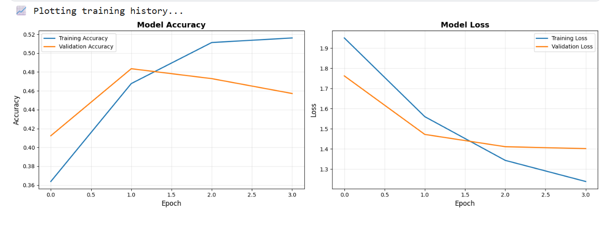
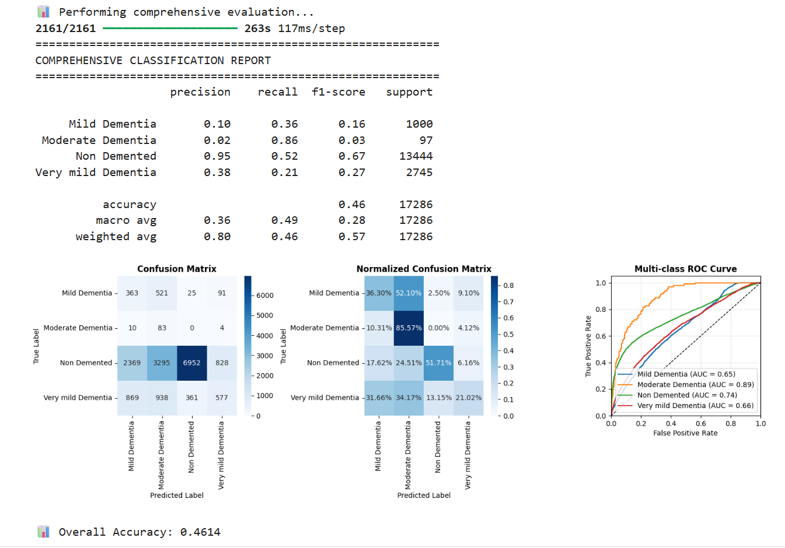

Prediction of Alzheimer’s Disease from Structural MRI Scans Using Modified DenseNet CNN

The project studies how a pretrained convolutional neural network can be applied to a highly imbalanced medical imaging dataset, and how data augmentation and class weighting affect performance.

Overview

Alzheimer’s disease causes progressive cognitive decline and structural brain changes that can be observed in MRI scans. Manual analysis of MRI images is time-consuming and can vary between observers.

In this project, a convolutional neural network is used to classify MRI slices into four disease stages:

Non-demented

Very mild dementia

Mild dementia

Moderate dementia

Dataset

In this study we use the ImageOASIS dataset which is pubicly available on Kaggle (https://www.kaggle.com/datasets/ninadaithal/imagesoasis). It contains 2D structural MRI slices grouped into four Alzheimer’s disease stages.

The dataset is strongly imbalanced. Non-demented samples account for the majority of images, while Moderate dementia samples are fewer.

An 80/20 train–validation split is applied using Keras’ built-in validation_split. 

Method
Model

DenseNet121 pretrained on ImageNet is used as a feature extractor

The convolutional backbone is frozen

A custom classification head is added:

Global average pooling

Fully connected layers

Dropout and batch normalization

Softmax output for four classes

Training Strategy

Data augmentation is applied only to the training set

Class weights are used to reduce the effect of class imbalance

Adam optimizer with a learning rate of 1e-4

Early stopping and learning rate reduction are enabled

Training was performed in a Kaggle GPU environment.

Results

The best model checkpoint was selected based on validation accuracy.

Quantitative Results

Validation accuracy (Keras) was approximately 0.76

Overall accuracy (scikit-learn) was approximately 0.46 and

Macro-average F1 score was approximately 0.28

The difference between Keras accuracy and scikit-learn metrics reflects the strong class imbalance in the dataset.

Training Curves

The following figure shows training and validation accuracy and loss across epochs.

Confusion Matrix

The normalized confusion matrix on the validation set is shown below.

The model detected Non-demented samples best while early-stage classes (Very mild and Mild dementia) are more difficult to distinguish due to limited samples.

Ablation Study

Several ablation experiments were conducted to evaluate the effect of different components:

Without class weights the recall drops significantly for minority classes

Without data augmentation the validation performance decreases

Reduced dropout increased overfitting was observed

These experiments confirm that both augmentation and class weighting are important for this task.

Limitations

Only 2D MRI slices are used (no 3D spatial context)

Strong class imbalance affects early-stage classification

Evaluation is performed on a single dataset

Results are not suitable for clinical use

The full training and evaluation pipeline is provided in the notebook located in the `notebook/` directory.

